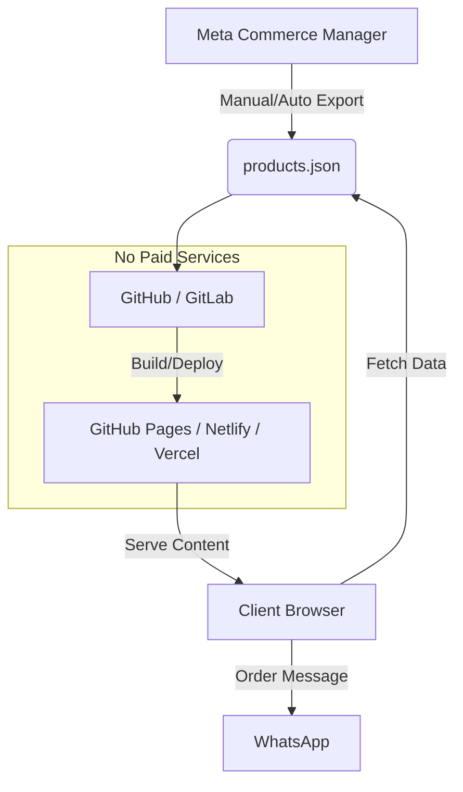

# WhatsApp Commerce Architecture - "Peludos y vanidosos"

## 1. System Architecture Diagram

This architecture follows a **Jamstack** approach (JavaScript, APIs, Markup) designed for zero running costs and high performance.



### Explanation
1.  **Single Source of Truth**: The Product Catalog is managed in **Meta Commerce Manager**. This allows the client to tag products on Instagram/Facebook seamlessly.
2.  **Mirroring**: The website consumes a `products.json` file. This file acts as a lightweight database.
3.  **Frontend**: A static HTML/JS site fetches this JSON and renders the store.
4.  **Checkout**: Instead of a complex payment gateway, the cart state is converted into a formatted text message sent via the **WhatsApp Click-to-Chat API**.
5.  **Order Processing**: The business owner receives the message, confirms availability, and sends a payment link (Nequi, Daviplata, Bold) directly in the chat.

---

## 2. Frontend Implementation Details
-   **Tech Stack**: Vanilla HTML5, CSS3, JavaScript (ES6+). No heavy frameworks (React/Angular) required for this scale, ensuring maximum speed (Lighthouse score ~100).
-   **Data Binding**: `fetch('products.json')` loads catalog data asynchronously.
-   **State Management**: `localStorage` persists the cart so users don't lose items if they refresh.
-   **Responsive Design**: Mobile-first approach, crucial since most WhatsApp users are on mobile.

---

## 3. Mock Meta Catalog JSON Schema
The `products.json` file follows the standard fields required by Facebook/Instagram Shops:

```json
[
  {
    "id": "SKU_123",
    "title": "Product Name",
    "description": "Full product details...",
    "availability": "in stock", // or "out of stock"
    "condition": "new",
    "price": "50000 COP",
    "link": "https://domain.com/product/123",
    "image_link": "https://domain.com/images/123.jpg",
    "brand": "Brand Name"
  }
]
```

---

## 4. Scaling to Real-Time Sync (Zero Cost)
To automate the update from Meta to the Website without paying for a backend server:

**Strategy: GitHub Actions (CI/CD)**
1.  **Trigger**: Schedule a GitHub Action to run every 6 hours (or trigger manually via webhook).
2.  **Action Script**:
    -   Python/Node.js script runs in the runner.
    -   Authenticates with **Facebook Graph API** using a long-lived token stored in Repository Secrets.
    -   Fetches the active catalog items.
    -   Overwrites `products.json`.
    -   Commits and Pushes the change back to the repository.
3.  **Result**: The static site hosting (e.g., Netlify) detects the commit and auto-redeploys.
4.  **Cost**: $0 (Uses GitHub Free Tier Action minutes).

---

## 5. Security & UX Best Practices

### Security
-   **No Client-Side Secrets**: Never store Meta API tokens in the `script.js`. The architecture above keeps tokens in GitHub Secrets.
-   **Input Sanitization**: While data comes from a trusted source (your JSON), always escape content before injecting into innerHTML to prevent XSS.
-   **HTTPS**: Mandatory for PWA features and trust. Provided free by Netlify/GitHub Pages.

### UX (User Experience)
-   **Persist Cart**: Users often switch apps. The cart must survive a page reload (`localStorage`).
-   **Visual Feedback**: Show a spinner while products load. Show a "badge" on the cart icon.
-   **Direct Checkout**: Minimize steps. 1. Add to Cart -> 2. Click WhatsApp -> 3. Send.
-   **Message Formatting**: The WhatsApp message should be clean and readable (using bold `*text*` and lists) to look professional.

---

## 6. Monetization Pitch for Clients

**"Why choose this architecture over Shopify/WooCommerce?"**

1.  **Zero Monthly Fees**:
    *   *Shopify*: ~$29/mo + transaction fees.
    *   *Our Solution*: $0/mo forever. You only pay for the domain (~$15/year).
2.  **Higher Conversion in LatAm**:
    *   Customers in Latin America trust chatting with a human more than entering credit card details on an unknown website.
    *   Closing the sale on WhatsApp allows for upselling and personalized service.
3.  **Blazing Fast Speed**:
    *   Static sites load instantly, even on 3G connections. Better SEO and lower bounce rates.
4.  **Ownership**:
    *   You own the code. You aren't rented a shop that can be shut down or have its price hiked.
5.  **Omnichannel Ready**:
    *   Since we mirror the Meta Catalog, your Instagram Shop and Website are always in sync (with the automation upgrade).

---
**Engineer**: [Your Name/AI Assistant]
**Date**: 2024-05-21
